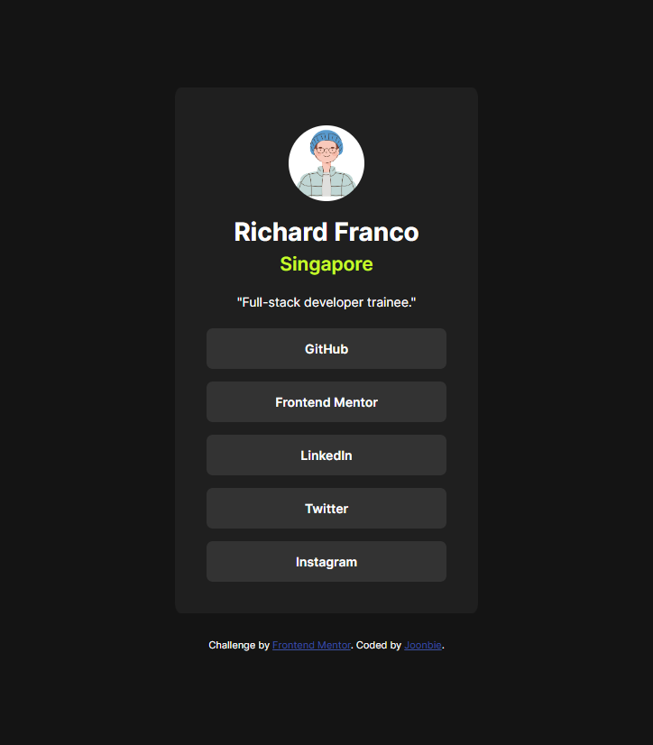

# Frontend Mentor - Social links profile solution

This is a solution to the [Social links profile challenge on Frontend Mentor](https://www.frontendmentor.io/challenges/social-links-profile-UG32l9m6dQ). Frontend Mentor challenges help you improve your coding skills by building realistic projects.

## Table of contents

- [Overview](#overview)
  - [The challenge](#the-challenge)
  - [Screenshot](#screenshot)
  - [Links](#links)
- [My process](#my-process)
  - [Built with](#built-with)
  - [What I learned](#what-i-learned)
  - [Continued development](#continued-development)
  - [Useful resources](#useful-resources)
- [Author](#author)
- [Acknowledgments](#acknowledgments)

## Overview

### The challenge

Users should be able to:

- See hover and focus states for all interactive elements on the page

### Screenshot



### Links

- Solution URL: [Github Repo](https://github.com/Joonbie/social-links-profile.git)
- Live Site URL: [Add live site URL here](https://your-live-site-url.com)

## My process

### Built with

- Semantic HTML5 markup
- CSS custom properties
- Flexbox

### What I learned

Something new for this challenge was to make the image appear as a circle.

```css
.banner img {
  border-radius: 50%;
}
```

### Useful resources

- [How to create rounded images](https://www.w3schools.com/howto/howto_css_rounded_images.asp) - This helped me for styling the image into a rounded image.

## Author

- Website - [Github Repo](https://github.com/Joonbie)
- Frontend Mentor - [@Joonbie](https://www.frontendmentor.io/profile/Joonbie)

## Acknowledgments

<a href="https://www.freepik.com/free-vector/happy-guy-illustration_146541159.htm#query=avatar&position=14&from_view=keyword&track=sph&uuid=48662d4f-bddb-4e45-8527-77675b0b85f8">Image by grmarc</a> on Freepik
